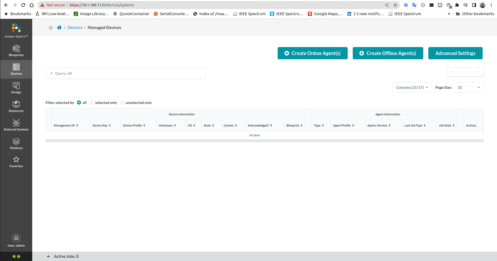
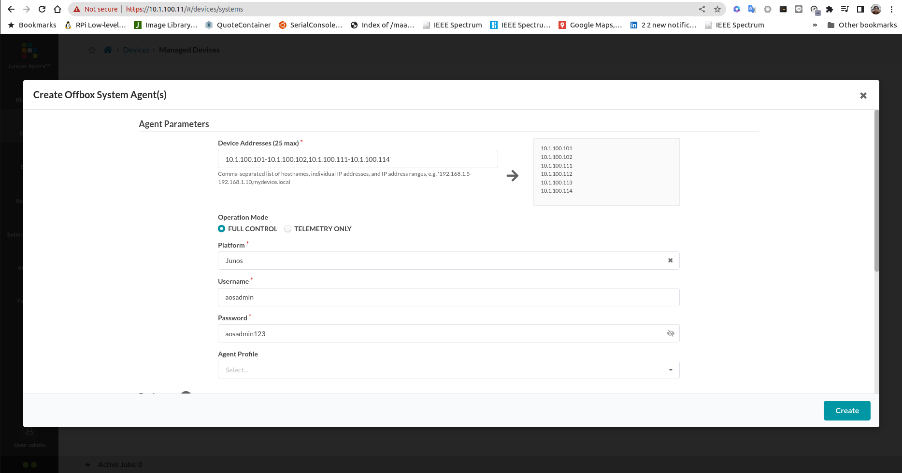
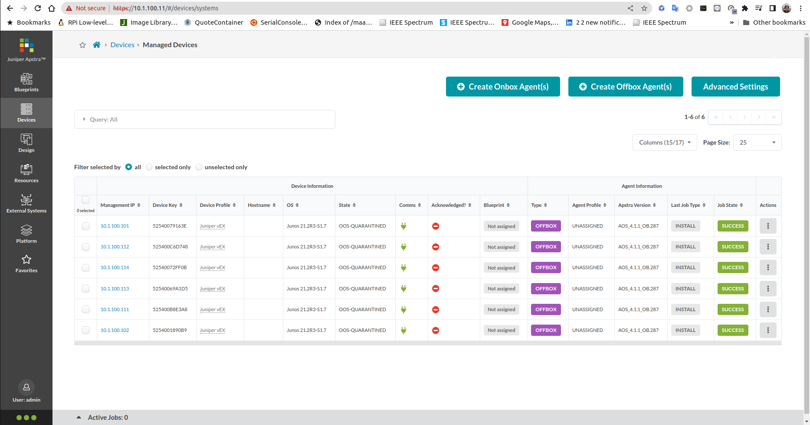
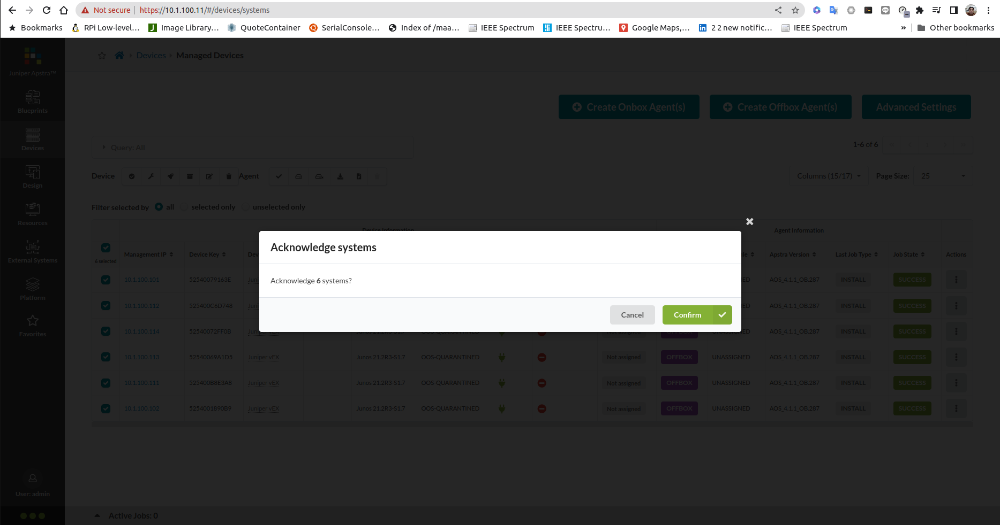
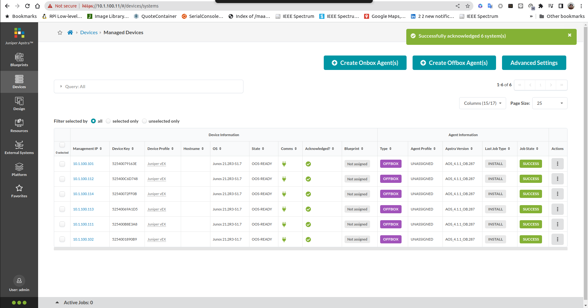

# Lab Exercise 0, Manage devices

In this lab exercise, the following will be done
- create offbox device agents

## Steps
1. Login into Juniper Apstra Web Dashboard
2. Verify that all devices have completed ZTP process (from menu **Devices > ZTP Status > Devices**)
3. From the left pane, select **Devices > Managed Devices** and click **Create offbox Agent(s)**

4. Enter the ip address of the devices which offbox system agent will be created, enter username/password, for ZTP the default username/password is aosadmin/aosadmin123, and click create

5. Wait until the **Job State** is success for all devices

6. Select all devices and click **acknowledge selected systems** to create offbox system agent

7. Now Juniper Apstra has managed all the virtualEX devices.

Now you can continue with the next [lab exercise](LabExercise_1.md)