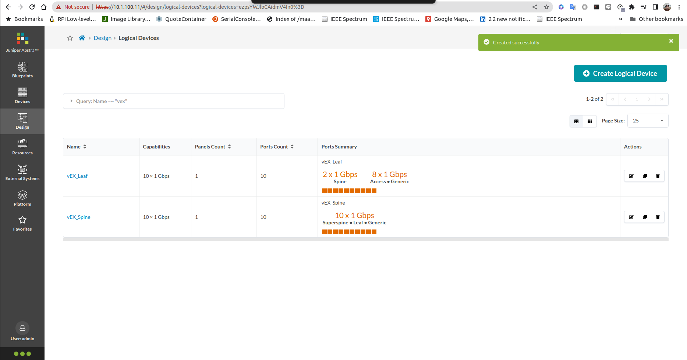

# Lab Exercise 1, Manage devices

In this lab exercise, the following will be done
- create logical devices for spine and leaf using virtualEX
- create interface maps for spine and leaf using virtualEX
- create rack-types 
- create templates for datacenter

## Create Logical Devices
1. Login into Juniper Apstra Web Dashboard
2. From the left pane select **Design > Logical Devices**. By default Juniper apstra comes with default logical devices that can be used. but in this lab exercise, logical devices for spine and leaf using virtualEX will be created.

3. Click **Create Logical Device** to create a new logical device
4. Create a logical device with the following parameter

    - name: vEX_Spine
    - number of ports : 10, speed 1Gbps
    - port group:
        - group 1:
            - number of ports: 10
            - connected to superspine, leaf, and generic

5. Click **Create Logical Device** to create another logical device
6. Create a logical device with the following parameter

    - name: vEX_Leaf
    - number of ports : 10, speed 1Gbps
    - port group:
        - group 1:
            - number of ports: 2
            - connected to spine
        - group 2:
            - number of ports: 8
            - connected to access and generic

6. Verify that two logical devices **vEX_Spine** and **vEX_Leaf** has been created

## Create Interface maps

1. From the left pane select **Design > Interface Maps**. By default Juniper apstra comes with default Interface Maps that can be used. but in this lab exercise, Interface maps for spine and leaf using virtualEX will be created.

3. Click **Create Interface Map** to create a new Interface Map
4. Create an Interface Map with the following parameter

    - name: vEX_Spine
    - logical device : vEX_Spine
    - Device Profile : juniper vEX

5. Click **select interface** and select port 0 - 9 

6. Click **Create** to create the interface map
7. Click **Create Interface Map** to create another Interface Map
4. Create an Interface Map with the following parameter

    - name: vEX_Leaf
    - logical device : vEX_Leaf
    - Device Profile : juniper vEX

5. For connection to **Spine**, click **select interface** and select port 0 - 1

6. For connection to **Access** and **Generic** , click **select interface** and select port 2 - 9

7. Verify that two interface maps **vEX_Spine** and **vEX_Leaf** has been created.

## Create Rack Types

1. From the left pane select **Design > Rack Types**. By default Juniper apstra comes with default Rack Types that can be used. but in this lab exercise, Rack Types for the template will be created, which will use the logical devices that was create previously.

3. Click **Create Rack Type** to create a new Rack Type
4. Create a Rack Type with the following parameter
    - name : Rack_type_1
    - connectivity design: L3 Clos
    - Leaf Name : Leaf_ESI
    - Leaf Logical Device: vEX_Leaf
    - Redundancy protocol: ESI

3. Click **Create Rack Type** to create another Rack Type
4. Create a Rack Type with the following parameter
    - name : Rack_type_2
    - connectivity design: L3 Clos
    - Leaf Name : Leaf
    - Leaf Logical Device: vEX_Leaf
    - Redundancy protocol: None

5. Verify that rack type has been created

## Create Template
1. From the left pane select **Design > Templates**. By default Juniper apstra comes with default Templates that can be used. but in this lab exercise, Templates will be created, which will use the rack-types that was create previously.

3. Click **Create Template** to create a new Template
4. Create a Template with the following parameter
    - name : DC1
    - Type: Rack Based
    - ASN Allocation: Unique
    - Overlay control protocol: MP-BGP EVPN
    - Redundancy protocol: ESI
    - Rack Types:
        * Rack_type_1 : 1 unit
        * Rack_type_2 : 2 unit
    - Spine Logical Device: vEX_Spine
    - number of Spines: 2

5. Click Create to create the template
6. Verify that the new template has been created

Now you can continue with the next [lab exercise](LabExercise_2.md)