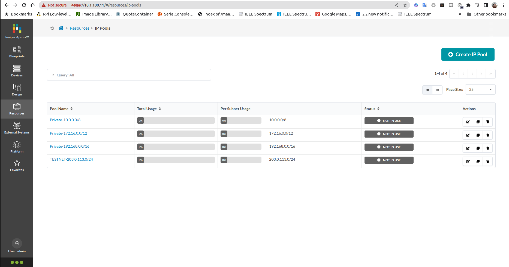

# Lab Exercise 2, Resources

In this lab exercise, the following will be done
- creating ASN Pool
- creating IP Pools
- creating IPv6 Pools

By default juniper Apstra comes with default ASN Pools, IP Pools, and IPv6 Pools.

But in this lab exercise, new set of pools will be create and will be used on the next lab exercise.

## Create ASN Pools
1. Login into Juniper Apstra Web Dashboard
2. From the left pane select **Resourcess > ASN Pools**. By default Juniper apstra comes with default  ASN Pools that can be used. but in this lab exercise, new set of ASN Pools will be created.

3. Click **Create ASN Pool** to create a new ASN Pool
4. Create an ASN Pool with the following parameter

    - name: ASN_Spine
    - ASN Range: 65001 - 65099

5. Create Create to create the ASN Pool
6. Click **Create ASN Pool** to create another ASN Pool
4. Create an ASN Pool with the following parameter

    - name: ASN_Leaf
    - ASN Range: 65101 - 65199

5. Create Create to create the ASN Pool
6. Verify that new ASN Pools has been created.

## Create IP Pools
1. Login into Juniper Apstra Web Dashboard
2. From the left pane select **Resourcess > IP Pools**. By default Juniper apstra comes with default  IP Pools that can be used. but in this lab exercise, new set of IP Pools will be created.

3. Here are the IP Pools which will be created

IP Pools | Subnet
-|-
Fabric-Link | 10.100.0.0/24
Spine-Loopback | 10.100.1.0/24
Leaf-Loopback | 10.100.2.0/24
VRF-Loopback | 10.100.3.0/24

4. Click **Create IP Pool** to create a new IP Pool, and repeat this step for each pool from the table

5. Verify that new IP pools has been create

## Create IPv6 Pools
1. Login into Juniper Apstra Web Dashboard
2. From the left pane select **Resourcess > IPv6 Pools**. By default Juniper apstra comes with default  IPv6 Pools that can be used. but in this lab exercise, new set of IPv6 Pools will be created.

3. Here are the IP Pools which will be created

IP Pools | Subnet
-|-
Fabric-Link | fc00:dead:beef:1000::/64
Spine-Loopback |  fc00:dead:beef:1001::/64
Leaf-Loopback |  fc00:dead:beef:1002::/64
VRF-Loopback |  fc00:dead:beef:1003::/64

4. Click **Create IPv6 Pool** to create a new IPv6 Pool, and repeat this step for each pool from the table

5. Verify that new IP pools has been create

Now you can continue with the next [lab exercise](LabExercise_3.md)