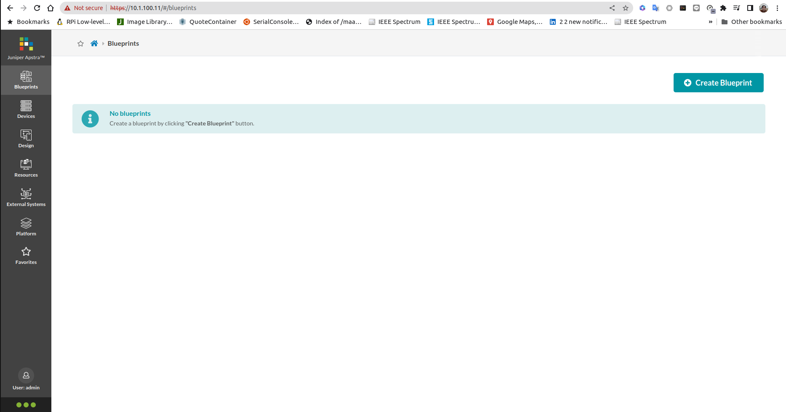
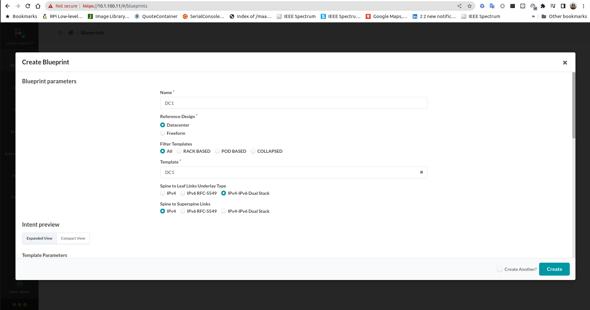
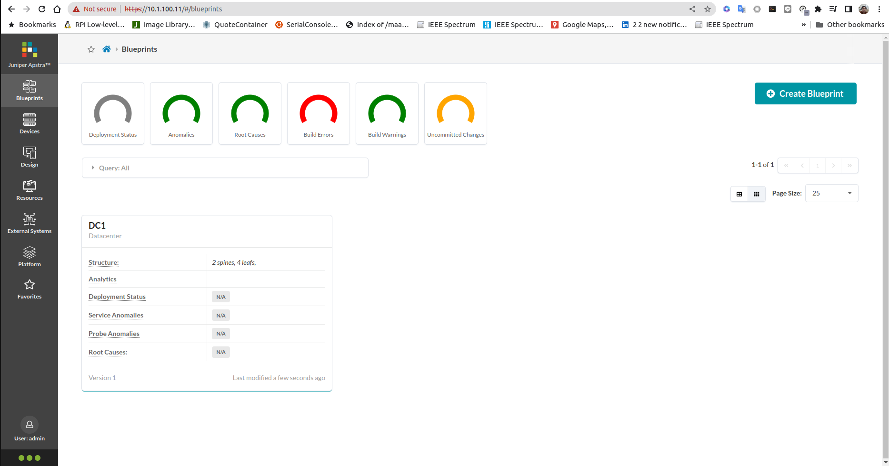

# Lab 3 , Blueprint

In this lab exercise, the following will be done:
- create Blueprint
- Assign resources to blueprint
- assign devices to blueprint
- deploy blueprint
- verify that configuration are pushed to the devices

## Creating Blueprint
1. Login into Juniper Apstra Web Dashboard

2. From the left pane select **Blueprint**
3. Click **Create blueprint** to create a new blueprint and use the following parameter
    - name : DC1
    - Reference Design: Datacenter
    - Template: DC1
    - Spine to Leaf Links Underlay Type: IPv4-IPv6 Dual Stack

4. Click **create** to create the blueprint

## Configuring blueprint
In this lab exercise, blueprint will be configured.

Click [this video](https://youtu.be/MQ0Qw11sz0w) on how to configure the blueprint.

Now you can continue with the next [lab exercise](LabExercise_4.md)