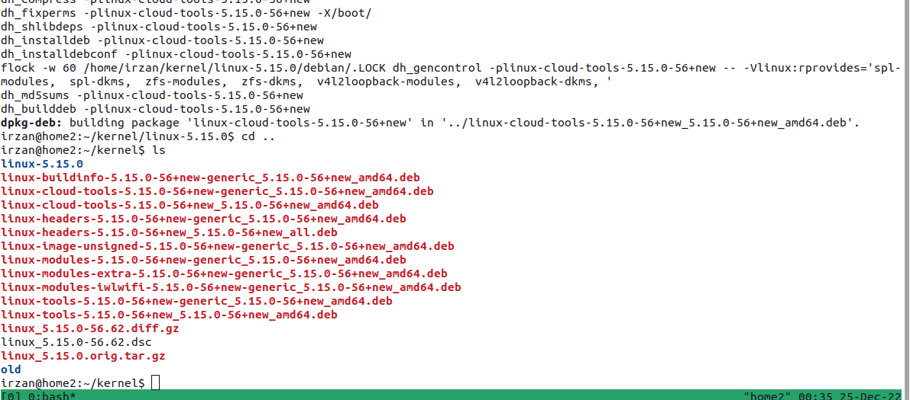

# Server preparation

## Linux installation
Install ubuntu linux server 22.04 

## Setup of Hypervisor 
Install KVM on Ubuntu linux.

Guide on how to install KVM on ubuntu 22.04 can be found on the Internet.

## Compiling linux kernel

Recompiling the linux kernel is required to allow LACP and LLDP frame to be forwarded by linux bridge on the hypervisor.

The default behaviour of linux bridge is blocking LACP and LLDP frame, and to allow LACP frame to be forwarded by linux bridge, the kernel behaviour must be changed, which requires editing the kernel source and recompiling the linux kernel.

The documentation on how to recompile the linux kernel can be found [here](https://wiki.ubuntu.com/Kernel/BuildYourOwnKernel).

Do the following steps to recompile the kernel

1. install the following package on ubuntu linux

        sudo apt-get build-dep linux linux-image-$(uname -r)
        sudo apt-get install libncurses-dev gawk flex bison openssl libssl-dev dkms libelf-dev libudev-dev libpci-dev libiberty-dev autoconf llvm

2. Install kernel source

        mkdir kernel
        cd kernel
        apt-get source linux-image-unsigned-$(uname -r)
        cd <linux_source_directory>

    
    

3. Run the following scripts (inside the linux_source_directory)

        chmod a+x debian/rules
        chmod a+x debian/scripts/*
        chmod a+x debian/scripts/misc/*
        LANG=C fakeroot debian/rules clean
        LANG=C fakeroot debian/rules editconfigs  # for this step, just answer Y, Exit, Y, Exit

4. Edit file debian.master/changelog, and add new label to indicated customized kernel
    
    Original Entry

    

    Modified Entry
    
    

5. Edit file <kernel_source>/net/bridge/br_private.h, and search for this entry

        #define BR_GROUPFWD_RESTRICTED

    

   change the original definition to the following

        #define BR_GROUPFWD_RESTRICTED 0x0000u

    

6. compile the kernel and it may take 60 - 90 minutes to finish. 

   If you are accessing the linux server remotely using ssh, then run the compiling process under tmux session. it will allow the compiling process to keep running even if the ssh session is disconnected.

        tmux 
        LANG=C fakeroot debian/rules clean
        LANG=C fakeroot debian/rules binary-headers binary-generic binary-perarch

7. Debian packages for the new kernel will be created on directory ../<kernel_source>

    

8. Install these package into the server

        cd ..
        sudo dpkg -i linux-headers*.deb
        sudo dpkg -i linux-image*.deb linux-modules*.deb

    
    
        
9. Verify that kernel has been installed

        grep -A100 submenu  /boot/grub/grub.cfg |grep menuentry

    

10. Edit file /etc/default/grub, and change entry **GRUB_DEFAULT=** to the new kernel (which was compiled and installed in the previous steps).

    Edit entry **GRUB_DEFAULT=** based on the output of step 9

    

11. Update grub

        sudo update-grub

12. This is the kernel version before reboot (original kernel)

    

12. Reboot server

        sudo reboot

13. This is the kernel version after reboot (modified kernel)

    

13. Run the following script to verify that linux bridge is now able to forward LACP and LLDP messages.

        sudo ip link add dev testBR type bridge
        cat /sys/class/net/testBR/bridge/group_fwd_mask
        echo 0x400c | sudo tee  /sys/class/net/testBR/bridge/group_fwd_mask

    if it said **invalid argument**, it means the kernel is still default, otherwise the kernel has been properly recompiled

    

    

14. Now the hypervisor is ready to be used, you can follow the [next documents](SetupLab.md) to setup the lab

