# Setup virtual Lab for Juniper DC solution with Apstra

## Lab Topology
This is the topology of the virtual which will be setup throughout this guide.

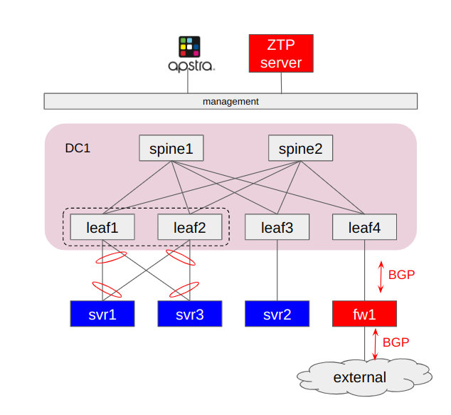

## VM in the Lab

|VM | OS | Node| disk Image
|-|-|-|-|
|spine1 | vEX |Spine| vEX disk image|
|spine2 | vEX |Spine|vEX disk image|
|leaf1 | vEX |Server Leaf with ESI-LAG|vEX disk image|
|leaf2 | vEX |Server Leaf with ESI-LAG|vEX disk image|
|leaf3 | vEX |Server Leaf|vEX disk image|
|leaf4 | vEX |Border Leaf|vEX disk image|
|fw1 | vSRX | DC gateway|vSRX disk image|
|svr1 | ubuntu | Dual-homed server|ubuntu disk image|
|svr2 | ubuntu | Single-homed server| ubuntu disk image|
|svr3 | ubuntu | Dual-homed server|ubuntu disk image|
|apstra| ubuntu | Juniper Apstra server | Juniper Apstra disk image| 
|ztp | ubuntu | Juniper Apstra ZTP server | Juniper Apstra ZTP server disk image|

## Linux bridge for connection between VM

|bridge | node A | Interface on node A| node Z | interface on node Z|
|-|-|-|-|-|
|s1l1|spine1|ge-0/0/0|leaf1| ge-0/0/0|
|s1l2|spine1|ge-0/0/1|leaf2| ge-0/0/0|
|s1l3|spine1|ge-0/0/2|leaf3| ge-0/0/0|
|s1l4|spine1|ge-0/0/3|leaf4| ge-0/0/0|
|s2l1|spine2|ge-0/0/0|leaf1| ge-0/0/1|
|s2l2|spine2|ge-0/0/1|leaf2| ge-0/0/1|
|s2l3|spine2|ge-0/0/2|leaf3| ge-0/0/1|
|s2l4|spine2|ge-0/0/3|leaf4| ge-0/0/1|
|l1p2|leaf1|ge-0/0/2|svr1| ens1|
|l2p2|leaf2|ge-0/0/2|svr1| ens2|
|l3p2|leaf3|ge-0/0/2|svr2| ens1|
|l1p3|leaf1|ge-0/0/3|svr3| ens1|
|l2p3|leaf2|ge-0/0/3|svr3| ens2|
|l4p2|leaf4|ge-0/0/2|fw1| ge-0/0/0|
|lan100|all virtual Junos|fxp0|-|-|

## IP address of the virtual machines

You can use the following table for the ip addresses or you can change it according to your local setup

| Node | Interface | IP address|
|-|-|-|
|spine1| fxp0|10.1.101.101/24|
|spine2| fxp0|10.1.101.102/24|
|leaf1| fxp0|10.1.101.111/24|
|leaf2| fxp0|10.1.101.112/24|
|leaf3| fxp0|10.1.101.113/24|
|leaf4| fxp0|10.1.101.114/24|
|fw1| fxp0|10.1.101.121/24|
|Juniper Apstra | eth0 |10.1.101.11/24|
|Apstra ZTP | eth0 |10.1.101.12/24|

## Create and Start the Virtual MAchines
1. Upload the disk image into Server
2. Open ssh session into the server
3. Run the following script [start_bridge.sh](scripts/start_bridge.sh) to create linux bridge
4. Verify that the bridges are up and running

        ip link show type bridge

5. Run the following script to create and start vEX/vMX virtual machines. (Remember to pause for 2 minutes between script)
   - [spine1.sh](scripts/spine1.sh)
   - [spine2.sh](scripts/spine2.sh)
   - [leaf1.sh](scripts/leaf1.sh)
   - [leaf2.sh](scripts/leaf2.sh)
   - [leaf3.sh](scripts/leaf3.sh)
   - [leaf4.sh](scripts/leaf4.sh)
   - [fw1.sh](scripts/fw1.sh)

6. Verify that the virtual machines are up and running

        virsh list

7. Access the serial console of one of the VM, and verify that it is running properly (for example interface ge-0/0/0...ge-0/0/5 are up and running)

        virsh console spine1

8. Run the following scripts to create and run Juniper Apstra server and Apstra ZTP server
   - [install_aos.sh](scripts/install_aos.sh)
   - [install_ztp.sh](scripts/install_ztp.sh)

## Initial setup of juniper Apstra server
1. verify that Juniper Apstra are running

        virsh list 

2. Access serial console of Apstra server

        virsh console <apstra server>

3. Login using default username/password: admin/admin, and change the password.
4. Set static ip for Apstra server. for example in this lab, this is the network configuration of apstra server

        ip address: 10.1.101.11/24
        gateway: 10.1.101.1
        dns server: 192.168.10.1

5. Verify that you can open ssh session into apstra server.
6. From your workstation, use web browser to access Juniper apstra web dashboard (the default username/password: admin/admin)
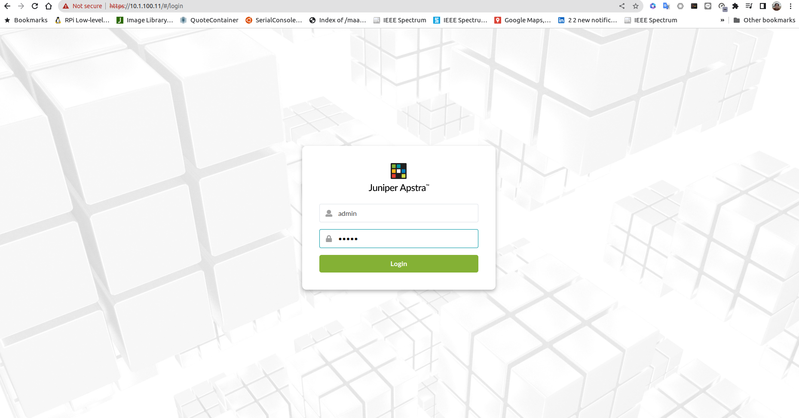
7. From the left pane, select **Platform>User** and create new user with the following parameter
        
        username: ztp
        Global Roles: device_ztp
        password: <password>

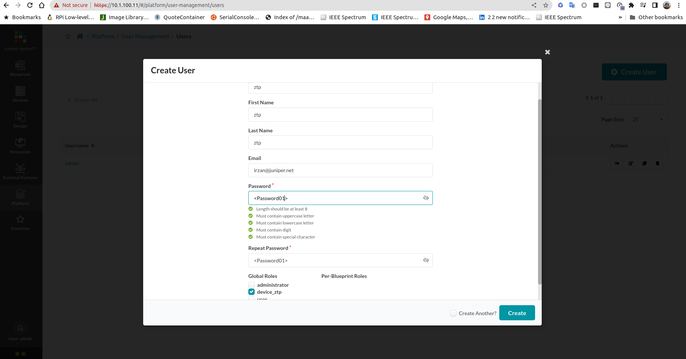

## get the MAC address of virtual Junos device
1. on the hypervisor, use the following command to get the mac address of the first interface (fxp0/management interface) of the virtual junos. 

        virsh dumpxml spine1 | grep -m 1 'mac address'
2. Repeat the previous step for all virtual Junos
3. Or the following script can be used to get the list of mac address

        for i in spine{1..2} leaf{1..4}
        do 
            echo $i 
            virsh dumpxml $i | grep -m 1 'mac address'
        done

    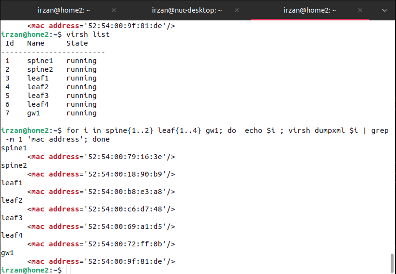

4. Edit file [set_ztp_dhcp.sh](scripts/set_ztp_dhcpd.sh), and change the hardware ethernet address according to list of mac from previous step

## initial setup of Apstra ZTP server
1. verify that Juniper Apstra are running

        virsh list 

2. Access serial console of Apstra ztp server

        virsh console <ztp server>

3. Login using default username/password: admin/admin.
4. Set static ip address for Apstra ZTP server

        IP address: 10.1.101.12/24
        gateway4: 10.1.101.1
        DNS server: 192.168.10.1
5. Or the following script, [set_ztp_net.sh](scripts/set_ztp_net.sh) to set the ip address of ZTP server

        cat << EOF  | sudo tee /etc/netplan/01-netcfg.yaml
        network:
            version: 2
            # renderer: networkd
            ethernets:
                eth0:
                    dhcp4: false
                    addresses: [ 10.1.101.12/24]
                    gateway4: 10.1.101.1
                    nameservers:
                        addresses: [ 192.168.10.1 ]
        EOF

6. apply the new network configuration  using the following command 

        sudo netplan apply

7. Verify that the ip address of the ZTP server can be reached from your workstation
8. Upload file [set_ztp_dhcp.sh](scripts/set_ztp_dhcpd.sh) into VM ZTP
9. On VM ztp, execute script set_ztp_dhcp.sh

        sudo ./set_ztp_dhcp.sh

10. on VM ZTP, open file /containers_data/dhcp/dhcpd.conf to verify that the macaddresses of the virtual junos has been added.
11. Search for the original **group** definition (it should be under step 2), and comment it out

    BEFORE

    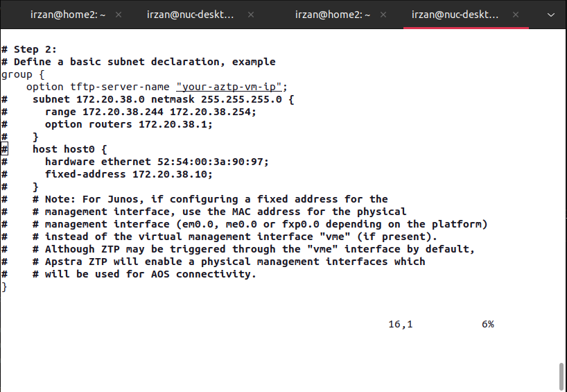

    AFTER

    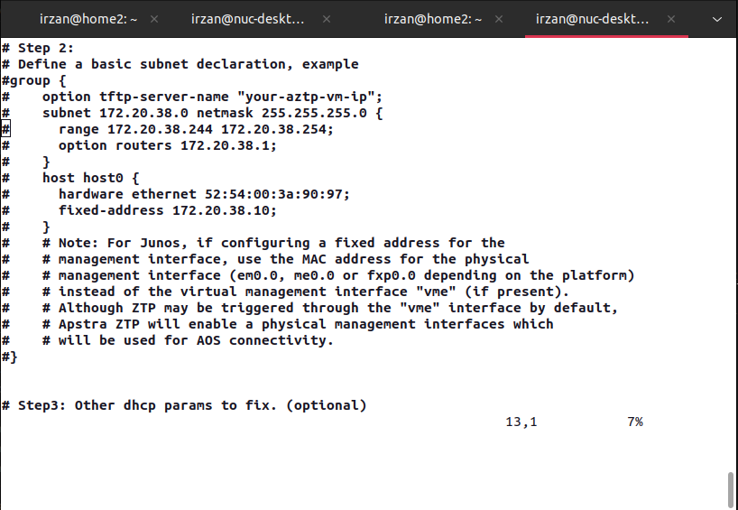

12. Edit domain and dns server information (it should be under step 3)

    BEFORE

    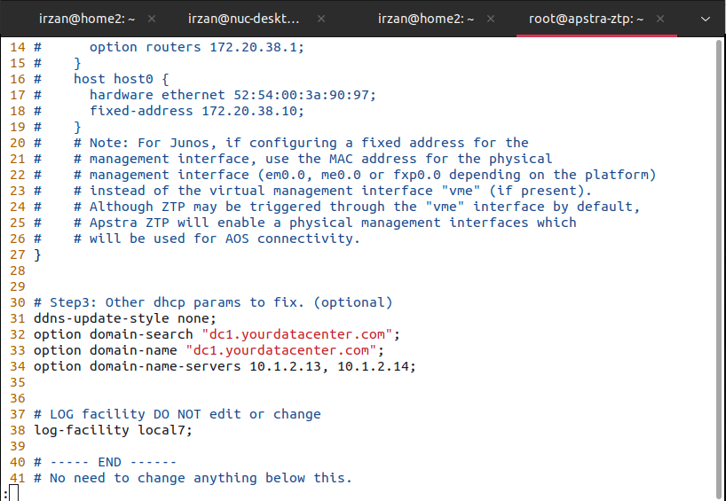

    AFTER

    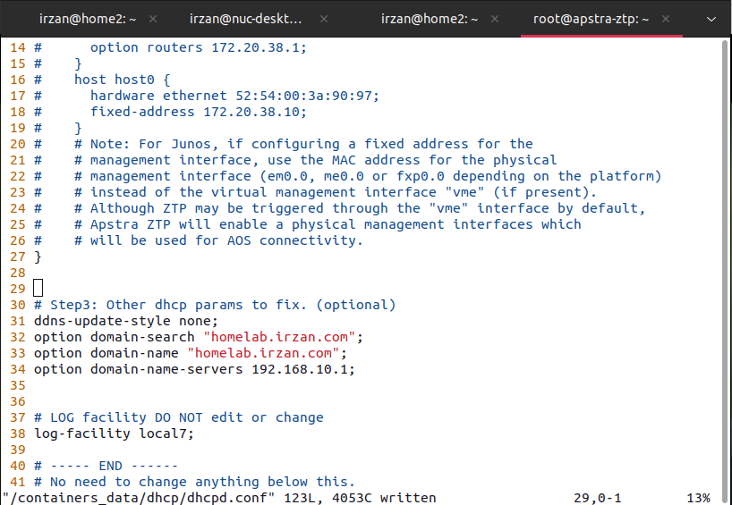

13. Edit file /containers_data/status/app/aos.conf, and set parameter with the following

        ip: <IP_Address_of_Apstra_server>
        user: <ztp_user>
        password: <password>

    BEFORE

    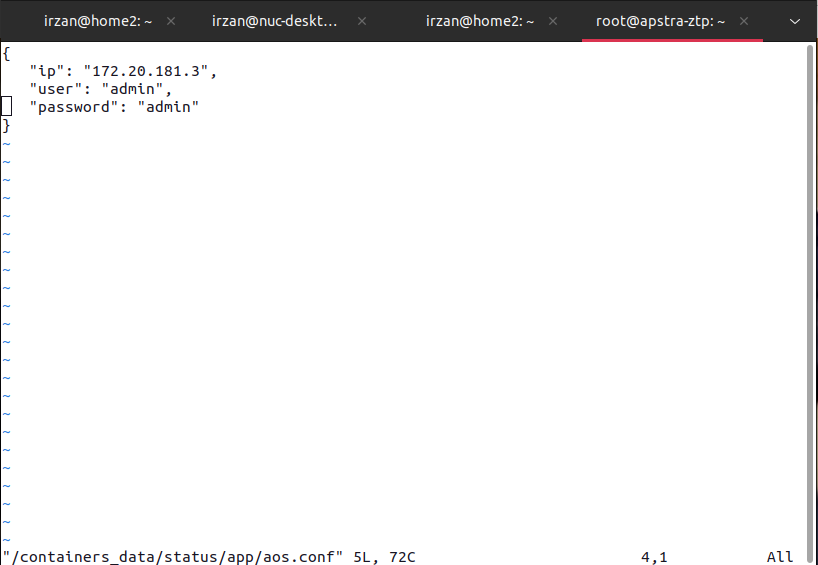

    AFTER

    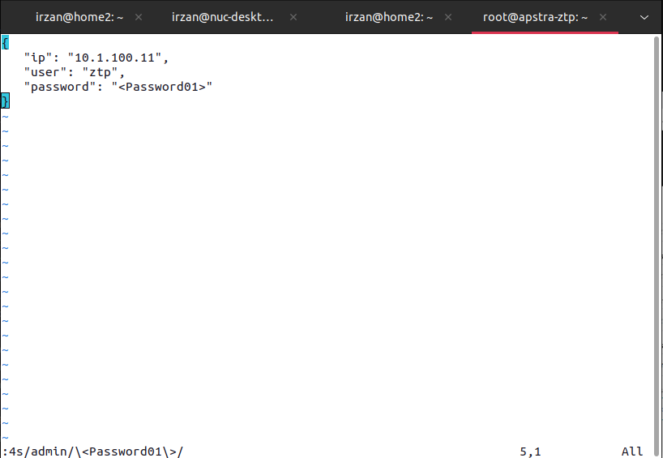

14. On VM ZTP, edit file /containers_data/tftp/ztp.json
15. Look for entry "junos_versions", and empty its values. This is to allow any version of Junos to be accepted during the ZTP process.

    BEFORE

    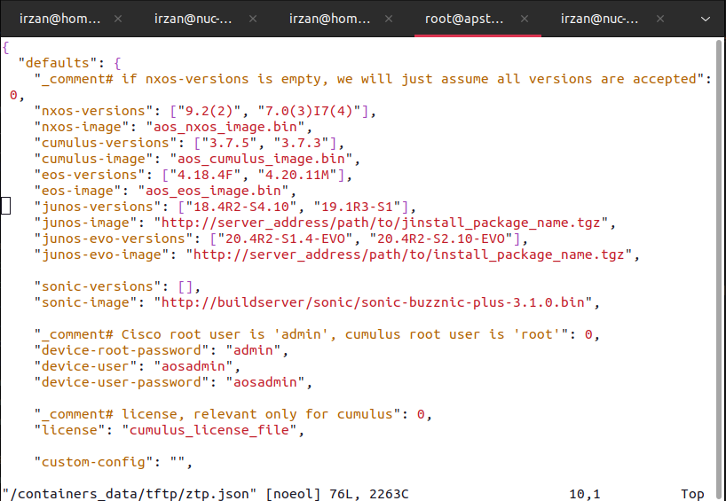

    AFTER

    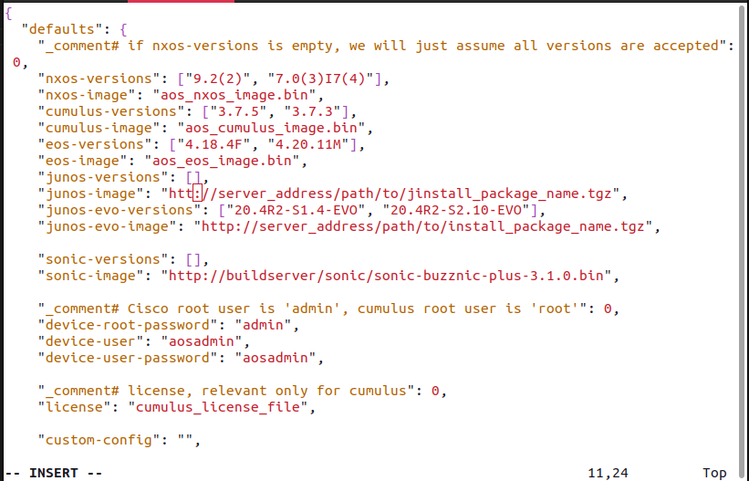

16. Reboot ZTP zerver
17. Then virtual junos (vEX) will go through ZTP process.

## Verifying ZTP proccess.

1. Open Apstra Web UI Dashboard, and go to menu **Devices > ZTP Status > services**, to verify that ZTP services is up and running

    BEFORE

    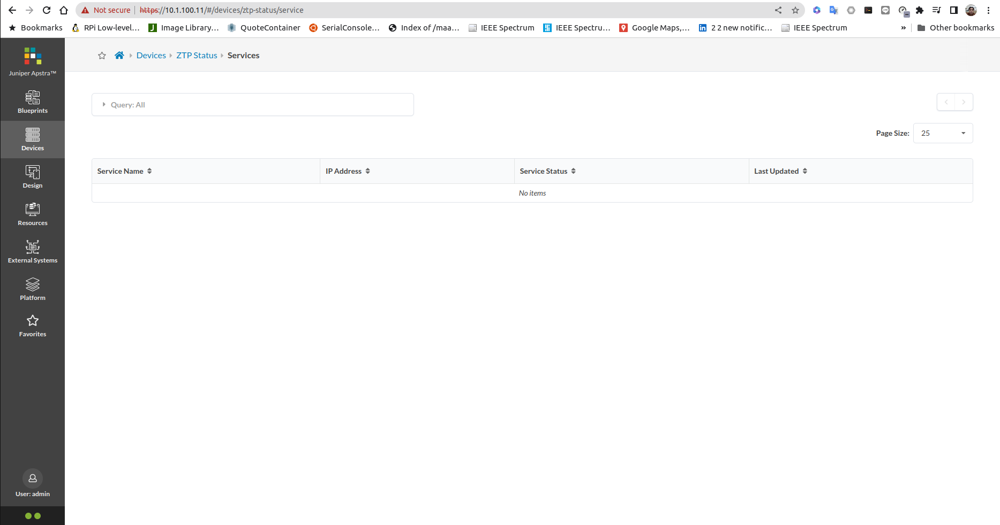

    AFTER

    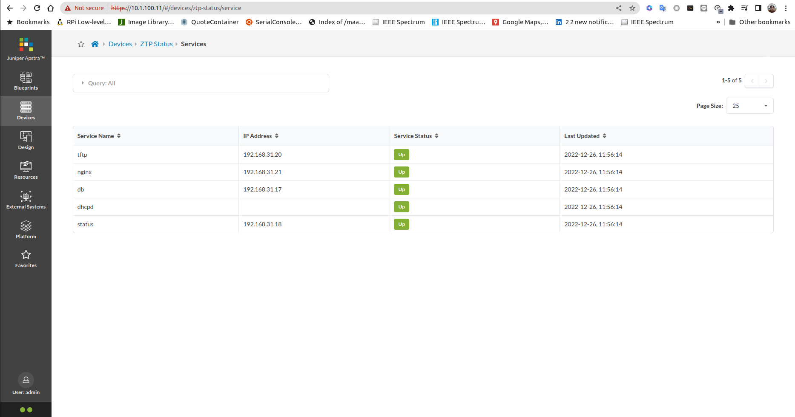

2. Go to menu **Devices > ZTP Status > Devices** to verify the ZTP process on junos devices. Wait until the ZTP status is completed

    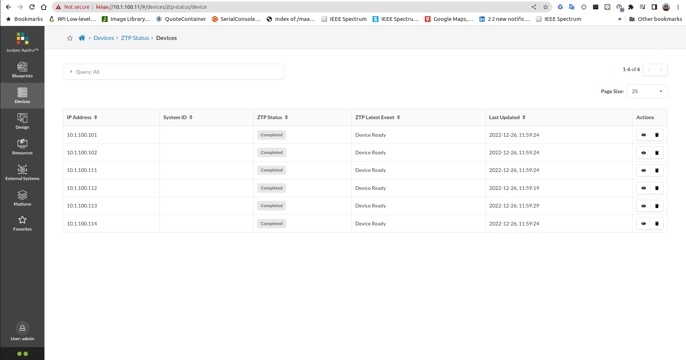

